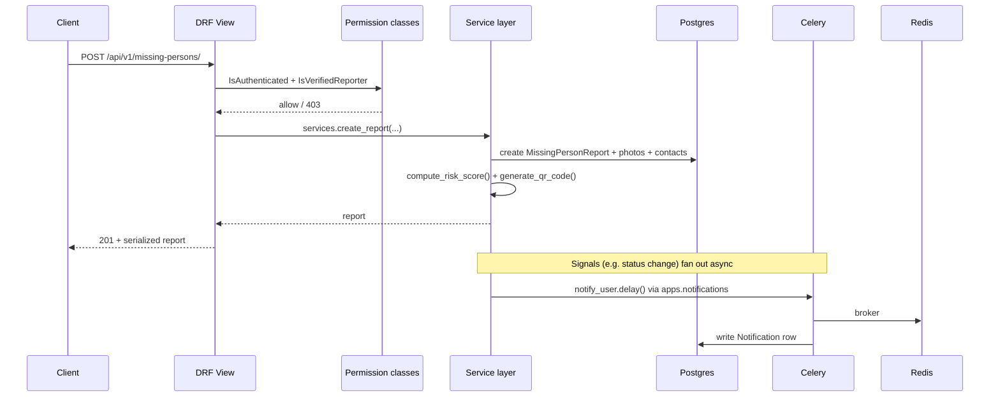
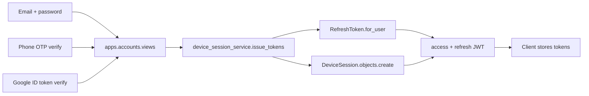

# Architecture

## Layering (per Django app)

Every app under `backend/apps/` follows the same internal layout. Not
every file exists in every app — only where that app actually needs it
(no empty placeholder files):

```
apps/<app_name>/
  models.py       # UUID PK, created_at/updated_at/is_deleted/deleted_at,
                  # created_by/updated_by (auto-stamped, see below)
  selectors.py    # read-only queries — anything a GET endpoint needs
  services.py     # writes + business rules — anything a POST/PATCH does
  validators.py   # reusable field-level validation, wired into serializers
  signals.py      # cross-cutting side effects (notifications on state
                  # change) — kept out of services.py so the core write
                  # path doesn't silently grow unrelated responsibilities
  permissions.py  # only where an app needs bespoke rules beyond apps.common
  serializers.py
  views.py        # thin: validate -> call selector/service -> serialize
  urls.py
  admin.py
  tests/
```

**Views never touch models directly for writes.** A view's job is: parse
the request, call a service function, serialize the result. This is what
makes the missing-persons "why does `find_possible_duplicates` behave the
same from the admin, the API, and a Celery task" question have one answer
instead of three.

## Shared foundation: `apps.common`

- `models.BaseModel` — UUID PK, soft delete (`is_deleted`/`deleted_at`,
  default manager excludes deleted rows via `SoftDeleteQuerySet`),
  `created_by`/`updated_by` auto-stamped from the in-flight request (see
  below). `GeoLocationMixin` adds plain `latitude`/`longitude` decimal
  fields plus a bounding-box helper — deliberately *not* PostGIS/GeoDjango,
  to avoid a GDAL system dependency for what's currently simple radius
  search (see `apps.common.geo.filter_within_radius`).
- `permissions.py` — role-gated base classes (`IsAdmin`, `IsNGO`,
  `IsHospital`, `IsVolunteer`), `IsOwnerOrReadOnly`, `IsVerifiedReporter`.
- `exceptions.py` — `DomainError` and subclasses raised from services,
  translated into HTTP responses by a custom DRF exception handler instead
  of leaking Python tracebacks or generic 500s.
- `middleware.py` — `RequestIDMiddleware` (X-Request-ID correlation),
  `CurrentUserMiddleware` (see below), `AuditLogMiddleware` (writes to
  `apps.audit_logs`).
- `native.py` — ctypes bridge to the native C engine, with pure-Python
  fallback (see `backend/native_engine/README.md`).

### How `created_by`/`updated_by` get set automatically

`CurrentUserMiddleware` stashes the in-flight request in a thread-local
(`apps.common.request_context`). `BaseModel.save()` reads it lazily at
save time. This works correctly for JWT-authenticated requests specifically
*because* DRF's `Request.user` setter writes back to the underlying Django
`HttpRequest.user` during view dispatch — which happens after the
middleware ran but before any service-layer `.save()` call — so by the
time a model saves, the thread-local's `request.user` really is the
authenticated user, not `AnonymousUser`. No JWT decoding happens in the
middleware itself.

## Request flow



## Auth flow

Three entry points, one outcome — a JWT pair plus a `DeviceSession` row so
the user can see/revoke sessions across devices:



Refresh rotation + blacklisting is handled by
`rest_framework_simplejwt.token_blacklist` (`ROTATE_REFRESH_TOKENS` +
`BLACKLIST_AFTER_ROTATION` in settings) — revoking a `DeviceSession` looks
up its `OutstandingToken` by `jti` and blacklists it, so a stolen refresh
token can be killed without knowing the token itself, only the session id.

## Why plain lat/lng instead of PostGIS

GeoDjango requires GDAL/GEOS system libraries, which meaningfully
complicates the Docker image and CI for a platform whose current need is
"filter candidates within N km" — solvable with a bounding-box pre-filter
(cheap, indexable on plain `DecimalField`s) plus an exact haversine cutoff
in Python (`apps.common.geo`) or natively (`native_engine`). If the
platform later needs real polygon/spatial queries (e.g., precise disaster
zone boundaries), `native_engine` already has `resq_point_in_polygon` as a
stepping stone, and PostGIS remains a valid future migration — it just
isn't a cost worth paying today for radius search alone.

## AI abstraction layer

`apps.ai_matching.interfaces` defines the pluggable contracts (face
recognition, image enhancement, duplicate detection, translation) as
ABCs with a `NotConfiguredEngine` no-op default. Nothing in the platform
depends on a specific ML library — swapping in a real model later means
implementing the ABC and changing `get_engine()`, not touching any view or
service that calls it.
